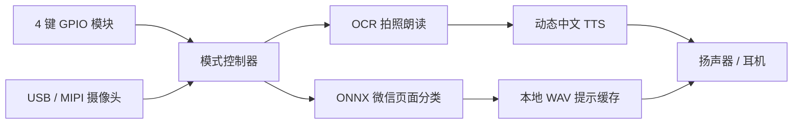

# Spacemit K1 MUSE Pi Pro

[](https://github.com/zww666-creater/Spacemit-K1-MUSE-Pi-Pro/actions/workflows/ci.yml)


基于进迭时空（Spacemit）K1 MUSE Pi Pro 的老年多模态生活辅助与数字引导系统。项目通过实体按键、摄像头、端侧 ONNX 推理、OCR 和离线语音反馈，帮助老年用户完成微信页面操作与纸质文字阅读。

项目以本地运行为主：图像无需上传云端，固定语音使用 wav 缓存，并针对 K1 CPU 推理、GPIO 按键和摄像头异常恢复做了专门优化。

## 已实现功能

- 按键 1（GPIO71）：拍摄文字，自动选择较清晰画面，完成 OCR 并朗读。
- 按键 2（GPIO72）：识别微信首页、聊天页、功能菜单和视频通话页并播报提示。
- 按键 3（GPIO73）：由常驻启动器拉起主程序，避免重复启动。
- 按键 4（GPIO74）：停止当前 OCR/微信功能、释放摄像头并返回待机。
- 固定提示优先播放本地 wav 缓存；OCR 动态文本可使用 `espeak-ng`/`espeak`。
- ONNX Runtime CPU 线程可调，支持 NCHW/NHWC 以及 float32/uint8 输入。
- 连续帧稳定门控、置信度阈值和重复播报间隔可调，减少抖动误提示。

## 系统架构



| 模块 | 状态 | 说明 |
|---|---|---|
| GPIO 四键交互 | 已实现 | 启动、OCR、微信引导和返回待机 |
| 微信页面识别 | 已实现 | 4 类 ONNX 页面分类与稳定播报 |
| OCR 拍照识别 | 已实现 | 自动选取清晰帧，支持多 OCR 后端 |
| 离线语音反馈 | 已实现 | 固定 wav 缓存 + 动态 TTS 降级 |
| 板端环境诊断 | 已实现 | 模型、依赖、GPIO、摄像头和音频自检 |
| 更多应用页面 | 可扩展 | 需补充数据集、类别配置和语音提示 |

## 目录结构

```text
.
├── python_code/
│   ├── assistant_with_voice.py   # 主程序
│   ├── k1_buttons.py             # 按键 3 常驻启动器/四键测试
│   ├── doctor.py                 # 部署环境自检
│   ├── camera_probe.py           # 摄像头枚举与读取诊断
│   ├── camera_classify.py        # 独立模型+摄像头测试
│   ├── benchmark_onnx_threads.py # ONNX 线程基准测试
│   ├── prepare_tts_cache.py      # 固定提示 wav 生成
│   └── runtime_utils.py          # 可测试的配置和预测门控逻辑
├── deploy/elder-ai-launcher.service
├── tests/
├── elder-ai.env.example
└── requirements*.txt
```

仓库不包含训练数据、ONNX 模型和生成的 wav/拍照文件。部署时需要单独放入模型。

## 板端快速部署

先克隆仓库，再把 `python_code` 中的板端脚本部署到运行目录。程序本身不再写死 `/home/hnu/elder_ai`，该目录只是推荐的 systemd 部署位置。

```bash
git clone https://github.com/zww666-creater/Spacemit-K1-MUSE-Pi-Pro.git
cd Spacemit-K1-MUSE-Pi-Pro

mkdir -p /home/hnu/elder_ai/models
cp python_code/*.py /home/hnu/elder_ai/
cp elder-ai.env.example /home/hnu/elder_ai/elder-ai.env
cp /你的模型路径/wechat_page.onnx /home/hnu/elder_ai/models/

python3 -m venv --system-site-packages /home/hnu/elder_ai/venv
/home/hnu/elder_ai/venv/bin/python -m pip install -r requirements.txt
```

K1 使用 RISC-V 架构。如果 PyPI 提示没有 `opencv-python` 或 `onnxruntime` 的可用 wheel，请保留板卡系统/官方镜像预装版本，或使用厂商提供的 wheel；不要强行从源码在板端编译。`--system-site-packages` 可以让虚拟环境复用这些板端包。

OCR 至少配置一种：

```bash
# 轻量方案
sudo apt install tesseract-ocr tesseract-ocr-chi-sim espeak-ng alsa-utils v4l-utils psmisc

# 或在板端已有兼容 PaddlePaddle 时安装 PaddleOCR
python -m pip install paddleocr
```

先做自检和硬件测试：

```bash
cd /home/hnu/elder_ai
set -a; . ./elder-ai.env; set +a
./venv/bin/python doctor.py
./venv/bin/python camera_probe.py
./venv/bin/python k1_buttons.py --test
```

自检通过后运行：

```bash
# 终端 1：常驻启动器，等待按键 3
./venv/bin/python k1_buttons.py

# 或跳过按键 3，直接调试主程序
./venv/bin/python assistant_with_voice.py
```

日志默认写入 `/home/hnu/elder_ai/assistant_with_voice.log`。

## 开机自启

确认 `deploy/elder-ai-launcher.service` 中的用户名和路径与板端一致，然后执行：

```bash
sudo cp deploy/elder-ai-launcher.service /etc/systemd/system/
sudo systemctl daemon-reload
sudo systemctl enable --now elder-ai-launcher.service
systemctl status elder-ai-launcher.service
journalctl -u elder-ai-launcher.service -f
```

启动器默认不再等待网络，因为视觉、按键和缓存语音均可离线运行。如确实依赖网络，可在 `elder-ai.env` 中设置 `NETWORK_WAIT_SECONDS=60`。

## 常用配置

所有配置均可放入 `elder-ai.env`，完整示例见 `elder-ai.env.example`。

| 变量 | 默认值 | 作用 |
|---|---:|---|
| `ELDER_AI_HOME` | 脚本所在目录 | 项目根目录 |
| `WECHAT_MODEL_PATH` | `models/wechat_page.onnx` | ONNX 模型路径 |
| `CAMERA_DEVICE` | 自动探测 | 优先摄像头设备，如 `/dev/video20` |
| `AUDIO_DEVICE` | `plughw:0,0` | ALSA 输出设备 |
| `ORT_INTRA_OP_THREADS` | `8` | ONNX CPU 线程数 |
| `WECHAT_INFER_INTERVAL` | `0.8` | 页面推理间隔（秒） |
| `WECHAT_CONF_THRESHOLD` | `0.40` | 最低播报置信度 |
| `WECHAT_STABLE_FRAMES` | `2` | 播报前要求的连续相同预测次数 |
| `WECHAT_REPEAT_SECONDS` | `6` | 同一页面重复播报间隔 |
| `OCR_SAMPLE_FRAMES` | `25` | OCR 拍照时参与清晰度选择的帧数 |
| `SHOW_WINDOW` | `0` | 设为 `1` 显示 OpenCV 调试窗口 |

## 模型与性能测试

类别顺序必须与训练时一致：

```text
home, wechat_chat, wechat_select, wechat_videochat
```

独立验证模型和摄像头：

```bash
python camera_classify.py --model models/wechat_page.onnx --camera /dev/video20
```

在目标板上选择合适的 ONNX 线程数：

```bash
python benchmark_onnx_threads.py --model models/wechat_page.onnx --threads 1 2 4 8 --runs 20
```

原型测试中，8 个 intra-op 线程曾将平均推理耗时从单线程约 2678 ms 降至约 455 ms。实际最优值取决于模型、板端镜像、温度和后台负载，应以上述脚本的现场结果为准。

## 语音缓存

若板端包含进迭时空 NLP 示例，可预生成所有固定提示：

```bash
SPACEMIT_NLP_PATH=/home/hnu/spacemit-demo/examples/NLP \
python prepare_tts_cache.py
```

使用 `--force` 可覆盖已有缓存。缺少某个 wav 时，主程序会自动尝试动态 TTS，并不会直接退出。

## 开发与验证

不连接 GPIO、摄像头和 ONNX Runtime 也能运行核心单元测试：

```bash
python -m pip install -r requirements-dev.txt
python -m compileall -q python_code tests
python -m ruff check python_code tests
python -m pytest -q
```

GitHub Actions 会在 Python 3.10 和 3.12 上执行同样的语法检查、静态检查和单元测试。

## 常见问题

- `Permission denied: /dev/gpiochip0`：为当前用户配置 GPIO 设备权限；临时测试可执行 `sudo chmod a+rw /dev/gpiochip0`，长期部署建议使用 udev 规则。
- 摄像头打不开：先运行 `camera_probe.py`，再把成功的设备写入 `CAMERA_DEVICE`。
- 没有声音：用 `aplay -l` 查看声卡，把正确设备写入 `AUDIO_DEVICE`。
- OCR 只打印不朗读：安装 `espeak-ng`，或接入板端可用的中文动态 TTS。
- 置信度一直偏低：确认类别顺序和训练时的 RGB、缩放、归一化方式一致。代码会保留已经是概率的模型输出，只对 logits 做 softmax。

## 隐私说明

摄像头推理、OCR 与语音反馈都可以在板端本地完成。OCR 拍摄的原图和预处理图会保存在 `ocr_captures/`，部署到真实用户环境前应制定自动清理策略并取得用户知情同意。
